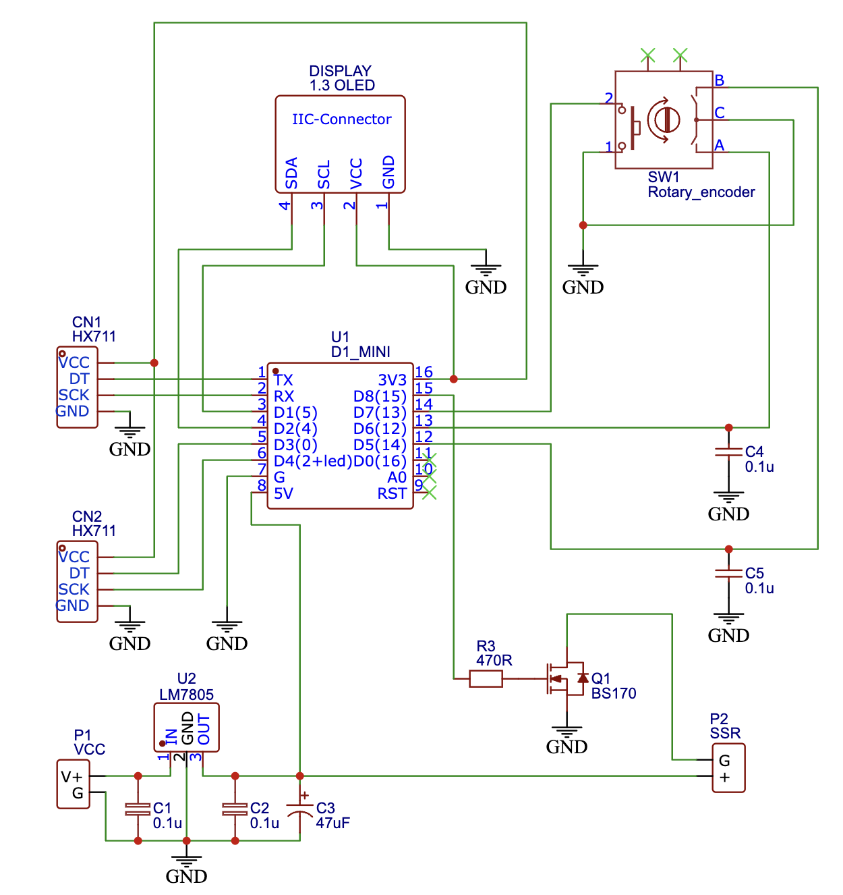

# Built-in scale for Rancilio Silvia

Built-in scale for the Rancilio Silvia espresso machine to measure weight of the
extracted coffee and stop the extraction after the the predefined weight of coffee
is poured into the cup. 

Heart of the solution is the Wemos D1 mini board and two 1kg load cells with HX711 ADC
convertors. Two SSR relays are utilized to turn on/off the solenoid valve and the pump.

## Circuit Diagram

## 3D Printed Parts

To install the two 1kg load cells to the Silvia's frame, I used (this model)[
  https://www.printables.com/model/897813-rancilio-silvia-loadcell-mount-slide-on-10mm-screw
].

Besides that, I designed and printed cases for other components that are available
in the [housing_models folder](./housing_models)

## Remote console

When the module is connected to WiFi, there is a remote console available at the
http://\<Device IP\>/webserial url. The list of possible commands is provided when the `help`
command is sent there.
